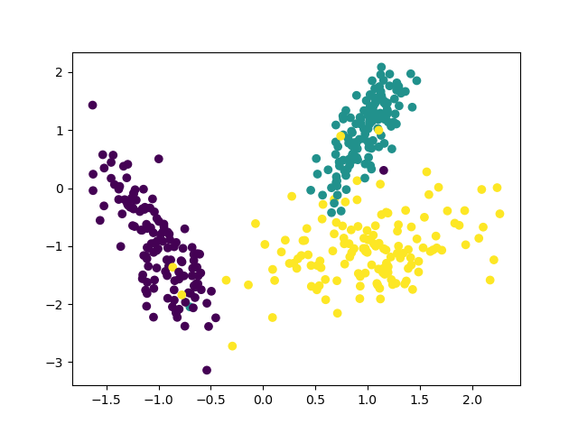
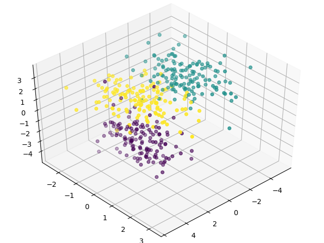

# Kmeans-by-MapReduce
Final assignment on course: Introduction to Cloud Computing

This project realized KMeans, a famous clustering algorithm, by MapReduce. And the report was accomplished together with Yuling Mao, Yanchun Lin at Sun Yat-sen University. 

## Results:
We first generated data for classification.

And the result of applying Kmeans algorithm is shown below.

